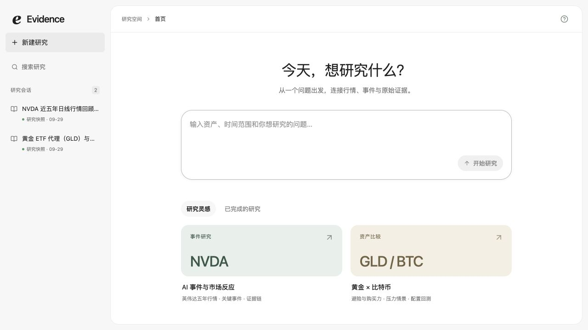
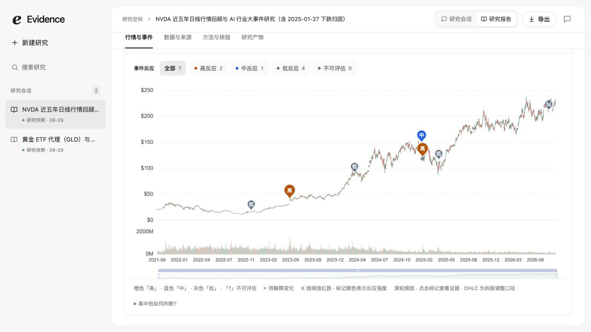
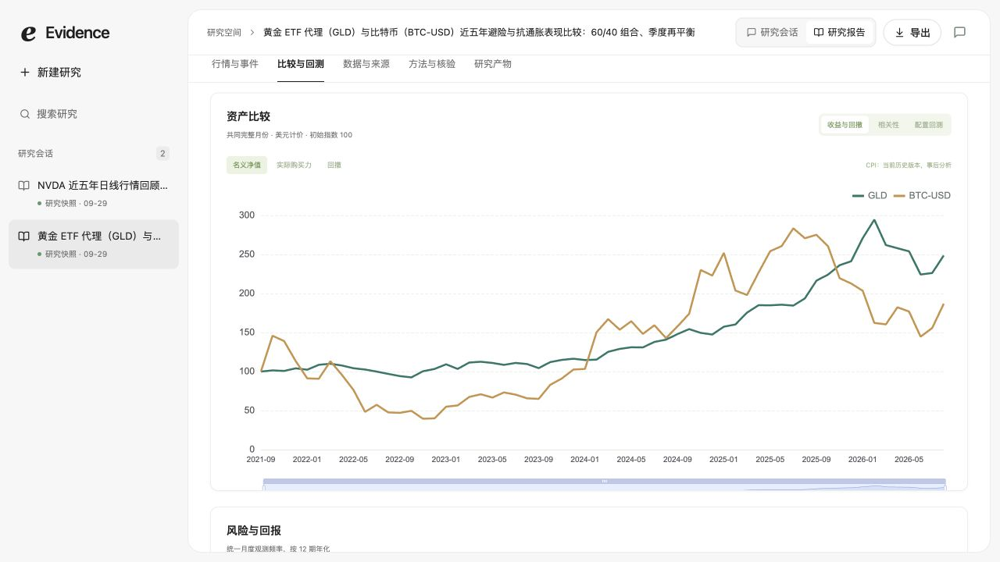
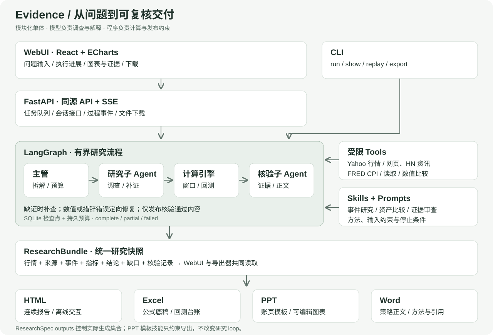

# Evidence · 可溯源投研 Agent

**输入研究问题，得到有行情、有证据、有计算依据的分析，并按要求导出报告。**

Evidence 是一个本地投研工作台。它把行情、行业事件与原始资讯放在同一份研究里：通过 Agent 调查和核验，通过 Python 计算指标，通过 WebUI 交互复核，最后交付可以独立打开的文件。

`Python 3.12` · `LangChain / LangGraph` · `FastAPI` · `React / TypeScript` · `ECharts`

[快速启动](#快速启动) · [WebUI 怎么用](#webui-怎么用) · [产物样例](#产物样例) · [架构](#架构) · [开发与验证](#开发与验证) · [完整文档](docs/README.md)

> **题目产物位置**（由 DeepSeek-V4.1-Flash 真实运行导出，已入库；说明与复核方式见 [`samples/README.md`](samples/README.md)）
>
> - 题目一 NVDA → 交互 HTML：[`samples/nvda/artifacts/report.html`](samples/nvda/artifacts/report.html)
> - 题目二 黄金 / 比特币 → Excel：[`samples/gold-bitcoin/artifacts/report.xlsx`](samples/gold-bitcoin/artifacts/report.xlsx) · PPT：[`samples/gold-bitcoin/artifacts/report.pptx`](samples/gold-bitcoin/artifacts/report.pptx) · Word：[`samples/gold-bitcoin/artifacts/report.docx`](samples/gold-bitcoin/artifacts/report.docx)



## 可以完成什么

| 场景                    | 研究内容                                                                                  | 用户指定的交付                          |
| ----------------------- | ----------------------------------------------------------------------------------------- | --------------------------------------- |
| NVDA 五年行情与 AI 事件 | 日线 OHLCV、ChatGPT / Blackwell / DeepSeek 等事件、行情异动、事件窗口与反应评级、原始来源 | 交互 HTML                               |
| 黄金与比特币比较        | 收益风险、实际购买力、压力月份、相关性、配置回测和参数敏感性；黄金使用 GLD ETF 代理       | Excel 底稿、PPT 决策框架、Word 策略报告 |

资产、区间、问题和格式由请求决定。**支持四种格式，不代表每次生成四份文件**：“报告 / 策略报告”默认 HTML，“文档”默认 Word；明确指定 Excel、PPT、Word 或 HTML 时按指定集合生成。也可通过 API / CLI 只研究、不导出。

项目中的“实时”指按请求获取可用数据，并实时展示执行进展；行情使用日线，**不是逐笔实时行情终端**。文件记录实际数据截止时间。

## 快速启动

### 1. 启动工作台，无密钥也能看样例

准备 **Node.js 22+** 与 **uv**，在解压后的项目根目录执行。Python 3.12 和锁定依赖由 uv 管理，首次安装需要联网。

```bash
./run.sh
```

Windows PowerShell：

```powershell
.\run.ps1
```

打开 **http://127.0.0.1:8000**。脚本会创建 `.env`、安装依赖并构建前端，不会自动打开浏览器。点击左侧研究快照，或首页“已完成的研究”，即可查看内置 NVDA、黄金/比特币样例及下载文件。

### 2. 配置模型，发起新研究

在自动创建的 `.env` 中填写：

```dotenv
LLM_MODEL=你的模型或部署别名
LLM_BASE_URL=https://你的兼容服务/v1
LLM_API_KEY=你的密钥
```

使用支持工具调用的 **OpenAI Chat Completions 兼容服务**，配置后重启。更多配置见 [.env.example](.env.example)。密钥只在服务端使用，不进入前端和导出文件。

在首页输入框粘贴以下任一请求，点击“开始研究”：

> 回顾 NVDA 近五年日线 OHLCV，梳理 ChatGPT、Blackwell（B100/B200）和 DeepSeek 的关键事件，解释主要行情变化，区分相关性与因果，最终生成交互 HTML。

> 比较黄金（GLD 代理）与比特币近五年的避险、抗通胀和配置价值，包含收益风险、实际购买力、压力情景与配置回测，生成 Excel 回测底稿、PPT 决策框架、Word 策略报告。

新研究会调用模型和公开数据服务。单次执行预算为 15 分钟，排队时间另计；每个必答问题都带有状态与依据，可在工作台逐项复核。

## WebUI 怎么用

工作台围绕 **提问 → 看过程 → 复核结果 → 下载** 组织。

| 入口                    | 你可以做什么                                                               |
| ----------------------- | -------------------------------------------------------------------------- |
| 首页 / 新建研究         | 输入资产、时间范围、研究问题和产物格式；灵感卡片只填入示例，点击发送才开始 |
| 左侧研究会话            | 搜索、切换和回看已保存任务；样例标记为“研究快照”                           |
| 研究会话                | 看真实阶段、工具动作、来源进展和核验后正文；基于当前研究继续追问           |
| 研究报告 → 行情与事件   | 缩放 K 线和成交量，筛选高/中/低反应，点击事件查看窗口收益和证据            |
| 研究报告 → 比较与回测   | 多资产研究中切换净值、购买力、回撤、相关性与配置视图，查看敏感性           |
| 数据与来源 / 方法与核验 | 核对原始数据、来源链接、计算口径和研究限制                                 |
| 右上角“导出”            | 跳转到本次研究的产物下载区，只展示该请求选择的格式                         |

**行情与事件：**K 线颜色表示涨跌，事件标记表示反应强度；强度、方向与证据可信度分别展示。



**资产比较：**在共同月份和明确计价口径下比较 GLD 与 BTC，进一步查看压力情景和配置回测。



点击事件可打开右侧证据面板，核对 1 / 5 / 20 日窗口、时间精度和原始链接。图文步骤见 [WebUI 使用指南](docs/webui.md)。截图来自本地历史样例，展示当前界面，不代表重新采集或重新核验了这些结论。

工作台用于研究、追问和重算；下载的 **HTML 是独立的连续报告**，带目录、图表和来源，不包含工作台 tab 或其他产物下载区。HTML 可离线交互，访问外部来源链接仍需联网；追问和更新数据需要启动应用。

## 产物样例

无需模型即可打开以下交付文件，目录说明见 [`samples/README.md`](samples/README.md)。GitHub 不直接运行 HTML；请下载后用浏览器打开。

| 样例          | 文件                                                        | 可复核内容                                                                     |
| ------------- | ----------------------------------------------------------- | ------------------------------------------------------------------------------ |
| NVDA          | [HTML 报告](samples/nvda/artifacts/report.html)             | K 线与事件联动、逐点归因表（已关联/已检索未发现/未检索）、来源链接、数据与方法 |
| 黄金 / 比特币 | [Excel 底稿](samples/gold-bitcoin/artifacts/report.xlsx)    | 行情、参数、公式、执行台账与来源                                               |
| 黄金 / 比特币 | [PPT 决策框架](samples/gold-bitcoin/artifacts/report.pptx)  | operating-review 账页风格，可编辑表格/图表与来源备注                           |
| 黄金 / 比特币 | [Word 策略报告](samples/gold-bitcoin/artifacts/report.docx) | 研究结论、比较图表、方法与来源                                                 |

每套样例附 `bundle.json`、`provenance.json` 和 `artifacts/manifest.json`，可核对研究版本、请求格式与文件哈希。两套样例均由 **DeepSeek-V4.1-Flash** 模型真实运行产出。NVDA 样例来自 2026-09-30 的运行 `e8a8611a`（方法 `2026.09.4`）：10 个事件、16 个来源，17 个 K 线变化点全部完成归因检索，其中 7 个关联到有来源的事件；B100 按官方命名对应 Blackwell 平台（B200/GB200）。详见 [归因覆盖说明](docs/attribution-20260930.md)。黄金/比特币样例的版本与状态以其 `bundle.json` 为准。真实研究正文与结果另见 [验收记录](docs/final-evaluation.md)。

## 架构



| 层                          | 职责与边界                                                                      |
| --------------------------- | ------------------------------------------------------------------------------- |
| **主管 / LangGraph**        | 拆解问题、组织采集与分析、分配预算、决定补查和发布；保留检查点                  |
| **研究子 Agent**            | 调用来源目录、检索与原文读取工具，围绕未回答的问题收集证据                      |
| **核验子 Agent**            | 独立上下文核对事实、指标引用和推断边界；完成度核验只接收已核验结论              |
| **Tools**                   | 有限的查询、读取、问题记录与数值比较；行情、事件窗口、回测由确定性代码计算      |
| **Skills / Prompts**        | 版本化的方法、步骤、停止条件和角色协议；PPT skill 约束导出模板，不介入研究 loop |
| **ResearchBundle / 导出器** | 统一保存行情、事件、来源、指标、结论和缺口；WebUI 与各格式读取同一快照          |

关键取舍：采用模块化单体，便于本地启动；模型负责调查与解释，程序负责计算与发布约束；按公开时刻和交易日关联事件，**同期反应不直接认定为因果影响**。行情使用 Yahoo，资讯覆盖公开网页 / HN / Yahoo，宏观使用 FRED CPI，更多来源可在服务端扩展。

架构细节、预算、数据契约和安全边界见 [设计说明](docs/design.md)；数据口径及插件接入见 [数据源扩展](docs/data-providers.md)。

## 开发与验证

```bash
uv sync --frozen
npm ci
npm run build                   # 同时构建 WebUI 与离线报告资源
uv run pytest -q
npm test
uv run ruff check backend tests tools
uv run ruff format --check backend tests tools
npm run format:check
uv run python tools/verify_samples.py
```

最近功能验证（2026-09-30）：**后端 340 项、前端 32 项通过**；构建与静态检查通过；NVDA HTML 已用无头 Chromium 打开检查（无控制台错误、无外部请求，归因表完整显示）。格式选择覆盖全部 16 种集合，并通过 13 个真实 planner 案例；PPT 经 69 页 LibreOffice 渲染检查文字边界。各项发生在不同验证批次，见 [完整验证记录](docs/validation.md)。

本项目使用 **Codex 辅助开发**：用户确定目标、关键口径和范围，Codex 实现代码、回归、工具检查和文档；用户授权阶段使用开发子 Agent 分工。开发过程、Prompt、技能与人工判断见 [AI 开发记录](docs/ai-development.md)。

## 代码与文档导航

```text
apps/web/                 React 工作台与独立 HTML 报告
packages/charts/          WebUI / 导出共用的图表配置
backend/research_app/     SDK、流程、计算、数据源、API 与导出器
prompts/ · skills/        角色提示、研究方法与 PPT 模板
resources/               来源目录
samples/                 两套研究快照与交付文件
tests/ · tools/ · evals/  回归、复现工具与实际验证记录
docs/                    设计、使用、开发、验收与截图
```

- **使用者**：[WebUI 图文指南](docs/webui.md) · [当前交付状态](docs/final-handoff.md)
- **开发者**：[工程指南（CLI / API / 调试 / 打包）](docs/development.md) · [设计说明](docs/design.md) · [数据源扩展](docs/data-providers.md)
- **评审者**：[评分维度](docs/rubric.md) · [AI 开发与 Prompt](docs/ai-development.md) · [验证记录](docs/validation.md) · [文档总览](docs/README.md)

当前面向单用户本地运行，没有多租户认证。前端同源访问后端，离线 HTML 内嵌资源并限制网络连接，密钥不入库；第三方许可见 [THIRD_PARTY_NOTICES.txt](THIRD_PARTY_NOTICES.txt)。Windows 与 Docker 提供入口，尚未完成实机验证。启动问题、开发端口和常见排查见 [工程指南](docs/development.md)。
