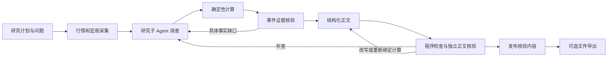

# 设计说明

当前版本 `2026.09.4`。模块化单体保留 FastAPI、React 和 LangChain / LangGraph。新增的研究正文层独立于 HTML / Office；本轮仅验证文字与结构化数据。验收状态与已知失败见 [调研可信度方案](agent-research-quality.md)。

历史八次真实评估与后续工程复核分开记录。最新修复见 [归因与处置](engineering-review.md)：核验器选择片段 ID，程序回填原句；显式缺口在补丁、恢复与完成判定间保留，关闭需可定位依据。模型语义判断表现不作为本轮工程待办。

## 从交付要求倒推边界

最小可信交付单位是一条“对应具体问题、有原文或计算依据、说明推断边界、通过核验”的结论。事件数量、模型调用次数、文件生成成功不能代替研究完成度。无法证明因果可以是合格的有限回答；缺少用户点名事实必须标记缺口。

以三个职责组织 Agent，不增加表演性角色。主管分解问题、管理预算、形成结论；研究者用工具调查具体缺口；核验者在独立上下文检查证据与措辞。受限结构化提取与争议复核属于上述职责的不同调用阶段，不另设自主权限。

## 数据契约

`ResearchBundle` 保留旧行情、事件、指标与报告字段，新增可选 `research`。缺少新字段的旧文件仍可加载，API 标记 `unassessed`，不继承可信状态。

| 记录 | 关键内容 | 谁负责 |
| --- | --- | --- |
| ResearchQuestion | 问题、验收要求、是否必答、点名事件、状态与缺口 | 主管建立，核验结果更新 |
| EvidencePassage | 来源 ID、连续短引文、原文偏移、内容哈希、时间、来源组 | 原文读取与程序定位 |
| ResearchMetric | 数值、单位、起止、频率、币种、方法、底层数据 ID | 确定性计算 |
| ResearchFinding | 问题引用、事实/分析/假设、证据、指标、反证、局限、改变判断的条件 | 主管起草 |
| NarrativeReview | 每条结论及每个问题的独立判定、修复方向、数值关系 | 核验上下文和程序 |
| ResearchAssessment | 已批准结论、逐轮核验、哈希、缺口、预算、正文与完成状态 | 发布门禁 |

标准方法建立必答问题。额外问题必须引用用户原文，程序以该原文建立验收条件，防止主管自行新增夏普、回归或参数网格后制造完成缺口。明确请求但未实现的计算保留为问题，不静默丢弃。

不同 URL 不等于独立证据：按发布域、已识别通讯社和正文哈希保守分组。完整网页保存在私有运行目录，交付的研究记录仅包含必要片段与可点击来源。引文必须连续且能在原文定位；语义支持仍由独立核验检查。

## 文字发布门禁

主管仅生成结构化草稿。正文的百分比、金额和系数必须引用 `{{metric_id}}`，格式化由程序完成。程序拒绝不存在的引用、缺少底层数据、手写财务数字、混合执行回测与价格回顾口径、无证据的结论。每条发布结论必须恰好得到一个 supported 判定。

核验者能查看原文上下文、指标方法与日期；单纯“引文存在”不足以支持因果、市场预期或机制。核验包括正文、反证、局限和改变判断条件。数值关系另转成高低、区间、正负等断言，由程序执行；模型不能以一句“通过”覆盖失败。仅列出多个指标不意味着它们相等。

核验职责分为两个独立上下文并行执行：`text-reviewer` 检查原文、数值关系和问题覆盖；`meaning-review` 专查属性、因果、机制与外推的证据边界，不被大量指标转录占用注意力。任一实质缺陷都阻止该条发布。两项核验使用同一个总预算；一项失败会取消并等待另一项，避免后台调用继续占用预算。旧核验证书缺少语义审查记录时不可复用。

网关兼容层先请求指定结构化输出函数；若服务忽略函数选择而返回完整 JSON，仅接受通过相同 Pydantic 模式的完整对象（可带完整代码围栏）。重复键、额外字段、任意段落中的 JSON 子串和 Markdown 表格均不接纳。适配只解决传输格式，不决定结论是否正确，严重发现仍保留。

修复只替换失败条目，保留核验通过的原文与哈希。证据问题定向补查，数值问题重新绑定确定性结果，夸大结论改写或删除。核验中断时仅保留此前已批准的条目，草稿不能进入用户正文或聊天历史。严重事件缺陷不能按 Claim ID 自动降级；争议复核中断保留原判。

正文发布状态：必答全部回答且数据/调查覆盖通过为 complete；有可发布内容和明确缺口为 partial；没有可发布内容为 failed。文件生成状态独立。`explain()` 与首次研究共用相同门禁。

## 时序与比较口径

事件分别记录业务发生、信息公开、报道、市场反应时刻。已证实的公开时间可用于研究，即使业务发生时间未知；回顾报道不能改写历史公开日期。精确时刻按交易日历对齐盘后公告；仅日期时计算当日和下一交易日窗口。窗口必须落在实际数据截止前。

异动与事件按同标的、公开先后及交易日距离建立候选关联。没有合适事件时保留未知；年度覆盖检查调查而非强制事件数量。方向、标准化反应强度、证据可信度独立，相对基准收益不等于独立因果贡献。

资产比较在共同股票月末锚点取已完成的价格。单资产与组合调用同一个下一可交易开盘执行引擎，初始资本、费用、区间和估值时点一致。价格回顾、执行回测、CPI 实际购买力属于不同方法，不直接争胜。压力月份、购买力、通胀关联、成本/权重/频率/分段敏感性全部传给正文层。

纯资产比较按研究问题获取产品定义及支持/反对资料，没有点名事件时不强制构建事件时间线或解释日线前五大异动。已读资讯仍是必要条件，宏观序列不能独自替代资讯来源。事件研究保留年代与重大异动的调查检查。

GLD 明确为黄金 ETF 代理；CPI 使用当前历史版本，只做回顾研究。预设分组不能证明稳定抗通胀机制，分段不是样本外验证，事后最优参数不是建议。

## 执行预算、恢复与接口

LangGraph SQLite checkpoint 保存节点；独立预算文件保存耗时、模型调用数，查询和读取计数跨补查与恢复保持。实际执行 900 秒，720 秒停止调查，最多 64 次模型调用、34 次检索、50 次读取。最多两轮检索补查、两轮正文修复。心跳预留五秒未落盘区间，崩溃不返还预算；排队不开始计时。模型调用计数是 SDK 调用次数，底层传输保留一次重试。

JSON 用唯一临时文件加原子替换，避免 SDK 并行工具争用固定临时文件。问题记录工具在事件循环内完成读改写。单用户工作队列原子领取任务，不支持多个进程同时恢复同一运行。

`POST /api/runs` 接受持久化 `export_reports`，默认 true 兼容旧行为；纯文字设 false。`GET /api/runs/{id}/research` 与 CLI `research show` 读取已核验正文。主会话可呈现无导出文件的结果。SSE 实时发送动作、来源和问题状态；正文核验后一次发布，保留 accepted/delta/done/error。追问独立 180 秒，仅使用当前快照；新增数据或范围应重新研究。

## 工具、技能与安全

工具只提供资产查询、来源发现、检索、保存原文、问题进度、数值换算等有限能力。计算引擎不接受任意模型代码。三个研究技能描述输入、调查步骤、错误边界与停止条件；Prompts 和 skill 内容哈希写入执行记录。

行情、新闻、宏观请求由后端执行，前端同源请求；离线报告内嵌依赖，CSP 限制脚本与连接。来源 URL 逐跳校验并固定公网解析 IP，拒绝内网、回环、云元数据。外部正文标为不可信数据，不能修改工具权限或预算。密钥仅在服务端配置，日志使用有限字段与脱敏错误。Excel 禁止将资讯文本解释为公式。

## 工程验证与取舍

单元和功能测试检查财务不变量、反例与失败发布行为；真实评估在普通测试之外调用实际服务，不伪造数据。八次最终评估固定版本、请求和日期，保存所有尝试，逐条内容审阅独立于生产核验器；自动测试不是事实准确率保证。

保留已有前端和导出器。上一轮纯文字评估跳过真实导出测试；后续按用户明确要求完成样例重导出与全部结构测试，不做视觉复核。样例结构迁移不意味着旧正文经过新的语义核验；历史与当前范围以验证记录区分。

语义判断与工程协议分开：独立上下文不能保证自然语言结论绝无错误，历史观察保留用于选择模型；本轮按用户要求不继续调优模型。可确定的协议故障则已修复：数值转录优先修复核验器，不能改正文或将 unsupported 升级；缺口不能因空补丁或 answered=true 自动消失。五个原始失败片段均通过定向复验，原始研究记录不覆盖。

数据源通过 `DataProviderInterface` 组合行情、资讯、宏观 Protocol，在 Pipeline 与工具间共享。默认公共适配器保留网络安全与缓存行为；受信服务端安装的 entry point 或显式依赖注入可替换单项能力，模型不能加载任意插件。商业服务的口径转换、认证和许可属于适配器责任；见 [数据源文档](data-providers.md)。

离线样例 replay 会规范化 Bundle、迁移 Schema 并重导出，然后保存一致快照与迁移记录；不改变原计算版本，不补造 research 正文。verify_samples 同时检查原始 Bundle、HTML 内嵌、JSON 与 manifest，防止只修测试断言却继续交付不同版本。GitHub Actions 在构建后运行全量 pytest、Vitest 和样例检查，避免缺少构建资源导致导出测试被跳过。
