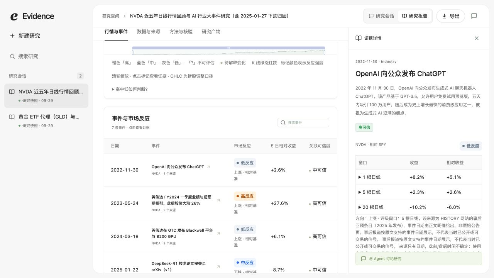
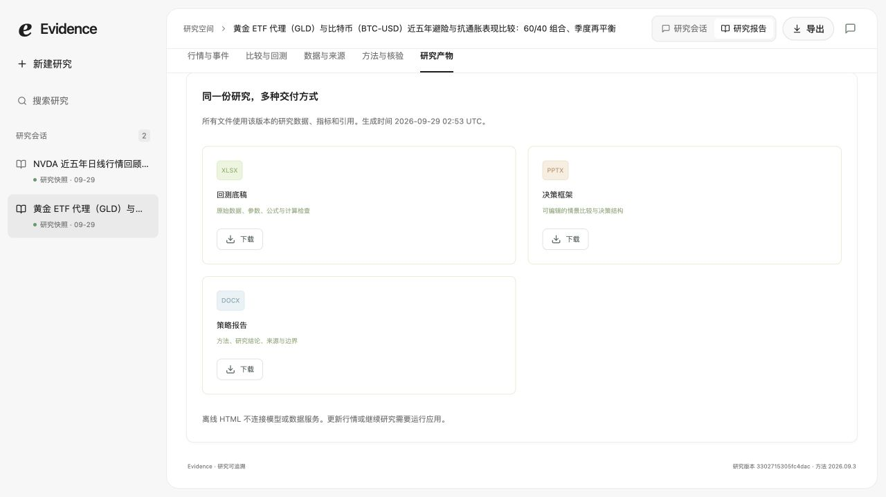

# WebUI 使用指南

从项目根目录运行 `./run.sh`，打开 http://127.0.0.1:8000。查看内置样例不需要模型密钥；发起新研究和追问需要配置服务端模型，见 [启动说明](../README.md#快速启动)。

## 1. 从问题开始

输入时说清四件事：**资产、区间、研究问题、交付格式**。例如“回顾 NVDA 近五年，调查 ChatGPT 与 DeepSeek 事件及行情反应，生成 HTML”。点击灵感卡片只会填入请求，点击“开始研究”才发送任务。

左侧“新建研究”返回新的输入区；“搜索研究”过滤已有会话。首页“已完成的研究”可以直接打开报告。样例标记为“研究快照”，无需为了浏览样例发起新任务。

## 2. 在研究会话中看执行进展

新任务发送后进入“研究会话”。这里展示阶段、工具开始/结束、来源进展与执行记录，正文在完成核验后发布。过程消息不等于最终结论，不能把检索条数当作研究完成度。

任务可能等待队列、需要补充信息、部分完成或失败。应优先阅读页面中的具体提示与待核实问题。研究状态与文件状态分开：有可发布的有限回答也可能是 `partial`，生成了文件不自动变成 `complete`。

输入框可继续追问，例如“解释高反应事件的依据”或“有哪些局限”。追问使用当前快照与最近会话，不自动刷新行情；换标的、延长区间或需要新数据时应新建研究。历史快照没有逐步执行记录时，页面会明确提示，不能从样例截图推断已重新执行过 Agent。

## 3. 查看行情，点击事件溯源

切换右上角“研究报告”，打开“行情与事件”。

- 用图表底部时间滑块或滚轮缩放区间；悬浮可查看当日日线数据。
- 用“全部 / 高反应 / 中反应 / 低反应”筛选事件；K 线涨跌颜色和事件反应颜色含义不同。
- 点击图中事件标记，或下方事件表的名称，打开右侧证据详情。
- 展开“高中低如何判断？”查看反应评级方法。

证据面板列出事件摘要、1 / 5 / 20 日窗口、相对基准收益、时间精度与来源链接。向下滚动面板可以访问原始来源。“反应强”是观测到的价格反应强度，“高可信”是证据维度，两者不是同一评分；相对基准表现也不是独立因果贡献。

“数据与来源”用于复核底层数据和链接，“方法与核验”用于查看口径与限制。历史样例中的事件核验与当前正文核验属于不同层级，`unassessed` 不应被理解为全部正文已通过最新审核。

## 4. 比较资产与配置

多资产报告提供“比较与回测”。顶部说明 GLD 的代理含义，并展示配置敏感性；向下滚动查看资产比较图表。

“收益与回撤”中可切换名义净值、实际购买力和回撤；“相关性”查看资产间关系；“配置回测”查看组合。敏感性可按权重、成本、再平衡与历史区间筛选。

比较时先看区间和计算方法。价格回顾、下一开盘执行回测与 Excel 公式近似有各自口径，不能混用。界面支持的配置重算会生成新的研究任务；离线文件不调用后端。历史分段与事后压力月份只提供回顾证据，不能当作样本外表现。

## 5. 下载指定产物

右上角“导出”跳转到“研究产物”。点击相应卡片的“下载”。

| 请求中怎么说              | 生成什么       |
| ------------------------- | -------------- |
| 报告、策略报告、交互报告  | HTML           |
| 文档、策略文档、Word 报告 | Word           |
| Excel、回测底稿、电子表格 | Excel          |
| PPT、演示文稿、汇报材料   | PowerPoint     |
| 明确列出多个格式          | 仅生成这些格式 |

“Word 策略报告”中的明确格式优先于“报告”默认值。指定 Excel/PPT/Word，不会额外附带 HTML。无文件导出可用 CLI `--no-export` 或 API `export_reports:false`。

HTML 下载后是连续章节的独立报告，可离线查看和操作图表，没有工作台 tab、追问输入区或其他产物下载区。访问外部来源需联网。Excel 可改参数并按其公式口径重算；PPT 原生表格/图表可编辑，Word 可继续编辑文字。来源、研究数据和 manifest 用于复核。

## 截图说明

以上五张截图于 2026-09-29 从当前 WebUI 的本地样例视图直接截取，未替换页面内容或伪造运行状态。截图环境使用隔离数据目录、禁用模型调用，只加载仓库的两套历史快照；采集时端口为 8011，日常启动默认为 8000。图片说明当前界面与操作路径，不是新一轮真实研究验收。截图文件与来源清单见 [配图记录](assets/README.md)。
